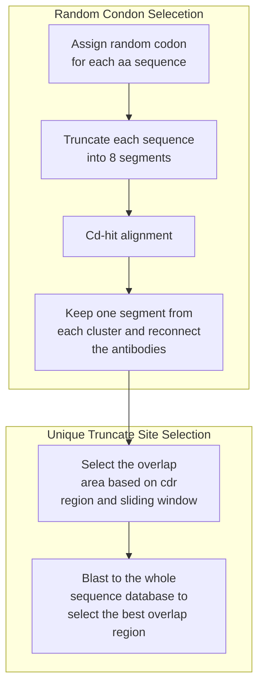

# Pipeline for Antibody Library Construction 

1. data filter:
    - `python script/extract.py -i data/TableS1.xlsx -v IGHV1-69 IGHV6-1 IGHV1-18 -d IGHD3-9 -g /home/wenkanl2/miniconda3/envs/Abs/lib/python3.9/site-packages/crowelab_pyir/data/germlines/Ig/human -o result/2024_0228_filtered.csv` 303 sequences left
    - manual delete the sequences:
    `sed -i '/008_10_6C04/d;/K77-1A06/d;/36.a.02_Heavy/d' result/2024_0228_filtered.csv`
2. Sequence Segments iteration
    `python script/iteration.py -i result/2024_0228_filtered.csv -p 2000000 -n result/random_neg.csv -o result/TableS1_filtered.fa`
    This process would also add some negative antibody as control.
3. Cd-hit
    `nohup bash script/cd-hit.sh > cd-hid.log &`
4. Select the CD-HIT result and reassembly
    `python script/cdhit_result.py -i result/TableS1_filtered.fa -n result/random_neg.csv -gs 25 -ng 12 -nn 2`
5. select the overlap region and replacing them
    `python script/Overlap_check.py -i result/TableS1_filtered.fa -n result/random_neg.csv`
    The script would generate possible overlap primers for each sequence. Each sequence would be generate 30 possible primers around the CDR region for selection in lateral step

!!! Next test starts from here
6. Blast them by using their self as database to pick the latest similar.
    `python script/ChunkByOverlap.py`

## Explaining:

### Extraction:

Python libraries: 
pandas, numpy, abnumber, Biopython, pyir

The first script is extract.py, which contains two main tasks. The first task is to extract all the sequences and filtering from the Excel file. And the second task is to complete the head and tail of antibodies. This is because some antibodies are intact from the previous research. During the processing phase, we align them according to Kabat numbers so that we can find any antibody with the missing head or tail. After that, annotations are made using Pyir. If we find that the antibody sequence is not intact, we then retrieve the germline from the database and complete the antibodies according to the germline sequence. 

# Result
After completing, we get 302 antibodies. We use the abysis.org to do the online Kabat numbering. For the light chain, 2 sequences (01.o.02_Heavy, 36.a.02_Heavy) are unnumbered and one sequence (008_10_6C04) still remaining incomplete. For heavy chain, here is one (K77_2F07) still missing one amino acid from the H1 and 017_10116_3D04 was failed to be Unnumbered. After that, we manually deleted the incomplete light chain (008_10_6C04), the unnumbered sequence  (36.a.02_Heavy), and the one has stop codon (K77-1A06).

1. Deleted unpaired antibodies
2. `AnnoG_Merge`
    1. Extract the nucl sequences and run igblast (pyir)
    2. Read the annotation result and retrieve the score of v gene
    3. Merge the table and sorting it based the V gene alignment score
    why should I care about v gene score?
3. `Table_clean`:
    1. Remove the common V gene family: IGHV1-69, IGHV6-1, and IGHV1-18.
    2. Remove the D gene family: IGHD3-9.
    3. Assign the id for unique clonotype (Clone type means the similarities of the antibody. The same clone type means they are similar. We just keep one sequence for each clone type.) 
    4. Exclude the clonotype 17.
    5. Keep the clonotype which are "HA:Ukn" only. (Because if the antibody was identified as the Stem antibody, we are not surprise other antibody from the same clone type are Stem-andtibody, too. So, here exclude them and only kept the "HA:Unk" and they are not similar to Other Stem antibody)
    6. Finally, we only kept one sequence from each clonotype
4. `Re_trans`:
    For somehow, some amino acid sequence-translation doesn't started in a correct position and containing stop codon. So, we try to translating them again when the sequences contain "*". After translation, all sequences end as TVSS or other similar sequences.
5. Antibody intact checking:
    For checking the intact of the amino acid, we aligned them into the Kabat number and checking if the first and the end aa are missing. 
6. In this function, we read the annotation result from the Pyir to retrieve the germlines id and get the germlines sequence from the database. And than, we fill the missing part if the germline sequence is complete.
7. Finally, we save the completed results

### Method

#### Antibody Sequence Selection and Completion

We developed a Python script (`extract.py`) to automate the extraction and processing of antibody sequences from an Excel file. Initially, the script filters out incomplete entries and uses Kabat numbering to identify and complete sequences that are missing heads or tails, with annotations performed via the `Pyir` software. Sequences are further refined by removing common V and D gene families (such as IGHV1-69, IGHV6-1, IGHV1-18, and IGHD3-9) and assigning unique clonotype IDs (from previous paper) to ensure diversity, keeping only non-redundant markers like "HA:Ukn."

Misalignments in amino acid translations (which containing stop codons) are corrected by retranslating sequences to ensure getting proper amino acid sequence. Additionally, incomplete sequences are completed using corresponding germline sequences from imgt database to ensure integrity from start to finish. Finally, all processed and validated sequences are compiled into a comprehensive dataset, ready for further analysis.

### Results

#### Comprehensive Analysis of Processed Antibody Sequences

Upon completion of our sequence processing workflow, we successfully compiled a dataset of 302 complete antibody sequences. These sequences were subjected to online Kabat numbering using the abysis.org platform to ensure accuracy in numbering and alignment. Despite the high success rate, we encountered minor issues with a few sequences: two heavy chain sequences (01.o.02_Heavy and 36.a.02_Heavy) could not be numbered, and one light chain sequence (008_10_6C04) remained incomplete. Additionally, another heavy chain sequence (K77_2F07) was missing an amino acid from the H1 region, and the sequence 017_10116_3D04 failed to be numbered.

To maintain the integrity of our dataset, we took further steps to refine it by manually removing the problematic sequences. The incomplete light chain sequence (008_10_6C04), the unnumbered heavy chain sequence (36.a.02_Heavy), and 5 sequence with a stop codon or contain "X" were all deleted from the dataset. These actions ensured that only the most reliable and complete antibody sequences (which contains 295 aa pairs) were included in our final dataset, optimizing it for subsequent analysis and research applications.

# Iteration

The codon table was from https://www.biologicscorp.com/tools/CodonUsage. Frequency of per thousands lower than 15 was deleted form the table to increasing the productivity. The main idea of this step is assigning random triplet codon for antibody sequences to reduce similarity among nucleotide sequences and deceasing the none native assembly in PCR.

After iteration step, the script would random select the number of negative results (50 as the example) and generate a number of codon pool. This is not the antibody full sequences pool, it is the segments pool. Each full antibody sequences are truncated into 8 segments which from 1 to 7 has exactly 99 bp and the 8th segment has the result of all sequences. This is in order to increasing the productivity of the result. For example, for a a library with 1000 ab, we'll generate a 2M random pool which each antibody has 2000 random codon sequences. By truncated them into 8 segments, we could possibly have 2000^7 which is 1.28*e^30 sequences by random combination.

The segments are clustered by the cd-hid based on the similarity. After that, only one sequences was selected from each cluster to ensure the dissimilar among all segments. Sequences are reconnected by those segments (`script/cdhit_result.py`). According to size of the assembly library, 25 sequences included 2 positive results are selected into 1 assembly library. The first step could mostly comfirm that each sequences are mostly similar in 70% and it would be ok to randon truncated into 4 segments and be assemblied by PCR. For further make the overlap unique and reduce the possibility of miss match caused by the overlap region, we figured a way to increasing decrease the possible similarity of Overlap region. After reassemblied, based on the ipyr annotation results, we selected CDR3 from light chain, CDR1 and CDR3 from heavy chain region (light chain is on the upper stream) to select a 30 nt size window and sliding it into both sides. In this way, we could generate a Overlap region pool (queries) for every Ab are generated. Rest of other sequences in the same library would be used as for subject sequences. The similarity between queries and subjects was calculated by the blast+ and most disliked query seq would be kept as the final overlap region. Once the final unique overlap gene was selected, we could truncate the Ab into 4 segments based on the 3 carefully selected overlap truncation-site. Replication primer from the 3' and 5' side was added in the ever end. Then the automatic generated library would be send to synthesis.

## After Manual Selection

# Method

We extracted all the sequences and filtered them from the Excel file, and annotations were made using Pyir. Then, we completed the head and tail of the antibodies using the corresponding germline, which were identified by Kabat numbering with Abysis. Some sequences that failed to be numbered or lacked too many amino acids were manually deleted. For reverse translation, the codon table was sourced from Biologics Corp. Frequencies per thousand lower than 15 were deleted from the table to increase productivity. Any random triplet codons were selected to reduce similarity among nucleotide sequences and decrease non-native assembly in PCR. The random codon library was generated by iterating all amino acids in antibodies. Fifty negative antibodies were also selected. To maximize the randomness of the nucleotide sequence, each result was truncated into 8 segments to become a segment pool. Segments 1 to 7 have exactly 99 bp (33 amino acids), and the 8th segment comprises the remaining sequence. In this way, the number of different antibodies was effectively increased to the power of 8 times.

Then, segments are clustered by cd-hit based on similarity. After that, only one sequence is selected from each cluster to ensure dissimilarity among all segments. Sequences are reconnected by those segments (script/cdhit_result.py). According to the size of the assembly library, 25 sequences, including 2 positive results, are selected for one assembly library. The first step ensures that each sequence is approximately 70% similar, allowing them to be randomly truncated into 4 segments and assembled by PCR. To further ensure the uniqueness of the overlap and reduce the possibility of mismatch caused by the overlap region, we devised a method to decrease the possible similarity of the overlap region. After reassembly, based on the ipyr annotation results, we selected CDR3 from the light chain, CDR1, and CDR3 from the heavy chain region (light chain is upstream) to select a 30 nt size window and slide it to both sides. In this way, we generate an overlap region pool (queries) for each antibody. The rest of the sequences in the same library are used as subject sequences. The similarity between queries and subjects is calculated using BLAST+, and the least similar query sequence is kept as the final overlap region. Once the final unique overlap gene is selected, we truncate the antibody into 4 segments based on the 3 carefully selected overlap truncation sites. Replication primers from the 3' and 5' ends are added to each end. Then the automatically generated library is sent for synthesis.

