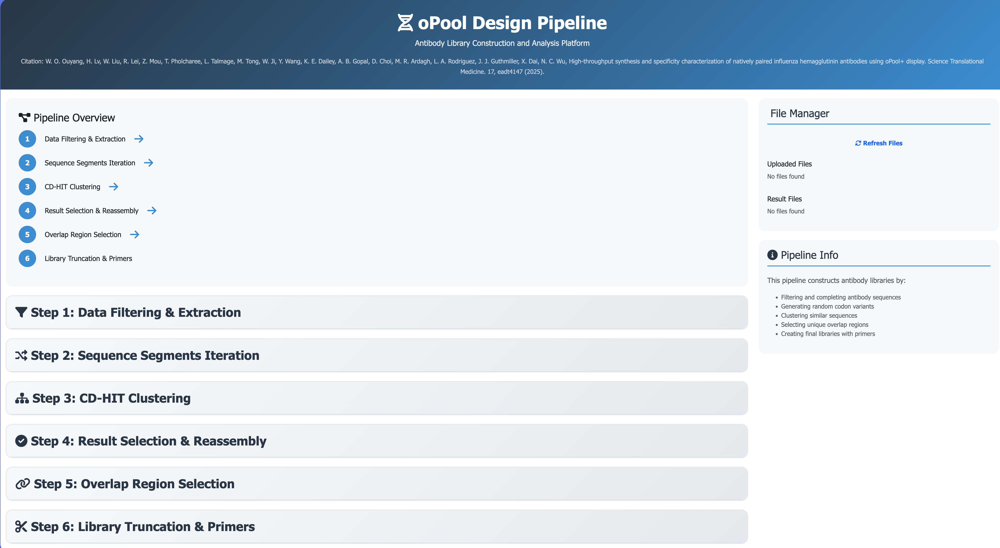
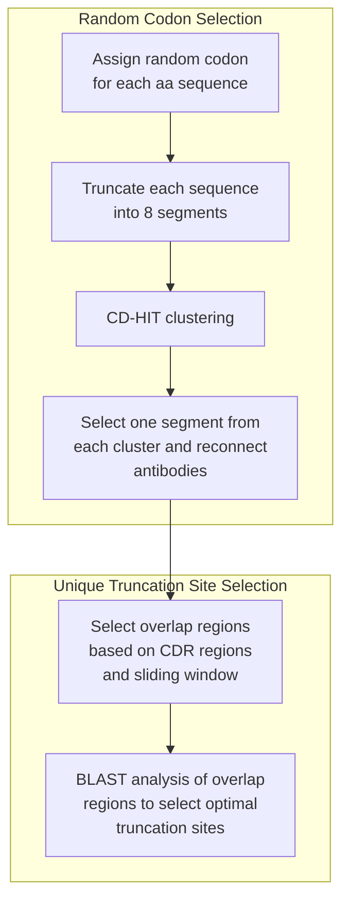

# Pipeline for Antibody Library Construction 

## Contents
- [Web UI](#web-ui)
- [Input File Requirements](#input-file-requirements)
- [Local Setup and Execution](#local-setup-and-execution)
- [Pipeline Workflow](#pipeline-workflow)
- [Technical Implementation](#technical-implementation)
- [Results and Analysis](#results-and-analysis)
- [References and Citations](#references-and-citations)

## Web UI

A local/web user interface, courtesy of the Cursor Agent, is available for running this pipeline through an intuitive browser page. The UI provides step-by-step workflow navigation, file management, and real-time progress tracking. Please see the following sections for input file requirements and how to set up/launch the UI.



## Input File Requirements

### Supported File Formats
- **Excel files**: `.xlsx` format (recommended for initial data)
- **CSV files**: `.csv` format with comma separation
- **TSV files**: `.tsv` format with tab separation
- **FASTA files**: `.fa` or `.fasta` format for sequence data

### Input Data Structure
The pipeline expects antibody sequence data with the following columns:

| Column | Description | Required | Example |
|--------|-------------|----------|---------|
| `Name` | Unique identifier for each antibody | Yes | `100F4`, `K77-1A06` |
| `VH_nuc` | Heavy chain nucleotide sequence | Yes | `ATG...` |
| `VH_AA` | Heavy chain amino acid sequence | Yes | `QVQL...` |
| `VL_nuc` | Light chain nucleotide sequence | Yes | `ATG...` |
| `VL_AA` | Light chain amino acid sequence | Yes | `DIQMT...` |
| `Heavy_V_gene` | Heavy chain V gene annotation | No | `IGHV4-61*03` |
| `Heavy_J_gene` | Heavy chain J gene annotation | No | `IGHJ4*02` |
| `Heavy_D_gene` | Heavy chain D gene annotation | No | `IGHD4-17*01` |
| `Light_V_gene` | Light chain V gene annotation | No | `IGLV1-40*01` |
| `Light_J_gene` | Light chain J gene annotation | No | `IGLJ1*01` |
| `Specificity` | Antibody specificity | No | `HA:Unk`, `Group 1` |

### Data Quality Requirements
- **Complete sequences**: Both heavy and light chain sequences should be present
- **Valid characters**: Nucleotide sequences should contain only A, T, G, C
- **No stop codons**: Amino acid sequences should not contain `*` characters
- **Proper length**: Sequences should be of appropriate length for antibody chains
- **Unique names**: Each antibody should have a unique identifier

### Example Input File

| Name | VH_nuc | VH_AA | VL_nuc | VL_AA | Heavy_V_gene | Heavy_J_gene | Heavy_D_gene | Light_V_gene | Light_J_gene | Specificity |
|------|--------|-------|--------|-------|--------------|--------------|--------------|--------------|--------------|-------------|
| 100F4 | CAG... | QVQL... | CAG... | DIQMT... | IGHV4-61*03 | IGHJ4*02 | IGHD4-17*01 | IGLV1-40*01 | IGLJ1*01 | HA:Unk |
| K77-1A06 | ATG... | QVQL... | ATG... | DIQMT... | IGHV1-69 | IGHJ1 | IGHD3-9 | IGLV1 | IGLJ1 | Group 1 |

## Local Setup and Execution

### Prerequisites
- **Python 3.9+** installed on your system
- **Conda** or **Miniconda** for environment management
- **Git** for cloning the repository
- **Web browser** for accessing the UI

### Step-by-Step Setup

#### 1. Clone the Repository
```bash
git clone <repository-url>
cd oPool_display/oPool_design
```

#### 2. Set Up Conda Environment
```bash
# Create and activate the oPool environment
conda env create -f environment.yml
conda activate oPool

# Or if you prefer to create manually:
conda create -n oPool python=3.9
conda activate oPool
conda install -c bioconda pyir cd-hit blast
conda install pandas numpy biopython openpyxl
```

#### 3. Install Web UI Dependencies
```bash
cd ui
pip install -r requirements.txt
cd ..
```

#### 4. Run Setup and Configuration
```bash
# Automatically configure directories and check dependencies
python setup_ui.py
```

#### 5. Launch the Web Interface
```bash
# Option 1: Using the main launcher (recommended)
python launch_ui.py

# Option 2: Using shell script
./launch_ui.sh

# Option 3: From the UI directory
cd ui
python start_ui.py
```

#### 6. Access the Web UI
- Open your web browser
- Navigate to: `http://localhost:5001`
- The interface will automatically open in your default browser

### Running the Pipeline

#### Through the Web UI (Recommended)
1. **Upload Input File**: Drag and drop your antibody sequence file (Excel/CSV format)
2. **Configure Parameters**: Set filtering options and pipeline parameters
3. **Execute Steps**: Run each pipeline step sequentially
4. **Monitor Progress**: Track execution in real-time
5. **Download Results**: Get processed files and analysis results

#### Through Command Line
```bash
# Step 1: Data Filtering
python script/extract.py -i data/TableS1.xlsx -v IGHV1-69 IGHV6-1 IGHV1-18 -d IGHD3-9 -g ${pyir_db}/Ig/human -o result/filtered.csv

# Step 2: Sequence Iteration
python script/iteration.py -i result/filtered.csv -p 2000000 -n result/random_neg.csv -o result/iterated.fa

# Step 3: CD-HIT Clustering
bash script/cd-hit.sh

# Step 4: Result Selection
python script/cdhit_result.py -i result/iterated.fa -n result/random_neg.csv -gs 25 -ng 12 -nn 2

# Step 5: Overlap Check
python script/Overlap_check.py -i result/iterated.fa -n result/random_neg.csv

# Step 6: Final Library Generation
python script/ChunkByOverlap.py
```

### Troubleshooting Common Issues

#### Port Already in Use
```bash
# Set custom port
export FLASK_PORT=5002
python launch_ui.py
```

#### Missing Dependencies
```bash
# Reinstall requirements
cd ui
pip install -r requirements.txt --force-reinstall
cd ..
```

#### PyIR Database Not Found
```bash
# Set custom germline database path
export GERMLINE_DB_PATH="/path/to/your/germline/database"
python launch_ui.py
```

#### Permission Issues
```bash
# Make scripts executable
chmod +x launch_ui.sh ui/start.sh
```

### Directory Structure After Setup
```
oPool_design/
├── uploads/              # User uploaded files
├── results/              # Pipeline output files
├── logs/                 # Application logs
├── ui/                   # Web interface files
├── script/               # Pipeline scripts
├── data/                 # Input data files
└── blastDB/              # BLAST database files
```

---

## Pipeline Workflow

### 1. Data Filtering:
    
The table was downloaded from the supplemental data of a paper by  [Wang, et al; 2024](https://www.cell.com/immunity/fulltext/S1074-7613(24)00371-6). We deleted unpaired antibodies, incomplete antibodies, etc.

This script relies on the `pyir` package for annotation and germline retrieval. The steps are as the [instruction](https://github.com/crowelab/PyIR)
After following the instruction, you should have the `pyir` database in the `crowelab_pyir/data/germlines/Ig/human` directory. If you don't know the location of the `pyir` database, you can run the following command to find it: `pyir -h| grep 'germlines'`

<pre>
Arguments related to file paths:
  --igdata IGDATA       Path to your IGDATA directory. Default is /data/home/w
                        enkanl2/miniconda3/envs/Abs/lib/python3.9/site-
                        packages/crowelab_pyir/data/germlines
</pre>

So, in my case, the absolute path of `-g` should be `/data/home/wenkanl2/miniconda3/envs/Abs/lib/python3.9/site-packages/crowelab_pyir/data/germlines/Ig/human`


- `python script/extract.py -i data/TableS1.xlsx -v IGHV1-69 IGHV6-1 IGHV1-18 -d IGHD3-9 -g ${pyir_db}/Ig/human -o result/2024_0228_filtered.csv`
    - `-i`: input table from the paper
    - `-v`: filtering list. We remove the sequences from the family you give.(Exp: IGHV1-69)
    - `-d`: similar as `-v`, but for D gene family.
    - `-g`: human IG sequences database from pyir for head and tail completion.
    - `-o`: output results. After filtering, there were 303 sequences left.

- `sed -i '/008_10_6C04/d;/K77-1A06/d;/36.a.02_Heavy/d' result/2024_0228_filtered.csv`
    
We manually deleted the sequences that looked weird by manually checking.

## 2. Sequence Segments Iteration

**Command:**
```bash
python script/iteration.py -i result/2024_0228_filtered.csv -p 2000000 -n result/random_neg.csv -o result/TableS1_filtered.fa
```

**Parameters:**
- `-i`: Filtered table as input (result from Step 1)
- `-p`: Total number of random sequences to generate for unique sequence selection
- `-o`: Output FASTA file containing truncated sequences (8 segments per antibody)
- `-n`: Negative control sequence list

**Output Format:**
Each antibody sequence is truncated into 8 segments, where segments 1-7 contain exactly 99 bp (33 amino acids), and segment 8 contains the remaining sequence.

## 3. CD-HIT Clustering

**Command:**
```bash
nohup bash script/cd-hit.sh > cd-hit.log &
```

**Process:**
- **Input**: `TableS1_filtered.fa` from Step 2
- **Method**: Groups sequences based on similarity using CD-HIT algorithm
- **Output**: Results stored in `cdhit/` directory
- **Note**: This step is computationally intensive. For testing, reduce dataset size or modify similarity threshold in `script/cd-hit.sh`

## 4. CD-HIT Result Selection and Reassembly

**Command:**
```bash
python script/cdhit_result.py -i result/TableS1_filtered.fa -n result/random_neg.csv -gs 25 -ng 12 -nn 2
```

**Parameters:**
- `-i`: Input FASTA file from Step 2
- `-n`: Negative control list (same as Step 2)
- `-gs`: Number of final sequences per group (default: 25)
- `-ng`: Total number of groups to create (default: 12)
- `-nn`: Number of negative control sequences per group (default: 2)

## 5. Overlap Region Selection

**Command:**
```bash
python script/Overlap_check.py -i result/TableS1_filtered.fa -n result/random_neg.csv
```

**Process:**
The script generates potential overlap primers for each sequence using BLAST+ analysis with the following parameters:
- **Query**: `Primer/{group}`
- **Database**: `blastDB/{group}`
- **Output format**: `6 qacc sacc evalue pident qcovs`
- **E-value threshold**: 1e-1
- **Threads**: 8
- **Max HSPs**: 2
- **Word size**: Variable

Each sequence generates 30 potential primers around the CDR regions for subsequent selection.

## 6. Library Truncation and Primer Addition

**Command:**
```bash
python script/ChunkByOverlap.py
```

**Process:**
Final antibody library generation with replication primers added to 3' and 5' ends for DNA synthesis.

---

## Workflow Overview



---

## Technical Implementation

### Antibody Sequence Processing and Completion

We developed a comprehensive Python pipeline (`extract.py`) to automate the extraction, filtering, and completion of antibody sequences from Excel-formatted datasets. The pipeline implements the following key steps:

1. **Initial Filtering**: Removal of incomplete entries and quality assessment
2. **Kabat Numbering**: Sequence alignment using standardized numbering schemes
3. **Germline Completion**: Identification and completion of truncated sequences using PyIR annotations
4. **Gene Family Filtering**: Removal of common V and D gene families (IGHV1-69, IGHV6-1, IGHV1-18, IGHD3-9)
5. **Clonotype Assignment**: Unique identifier assignment based on sequence similarity
6. **Sequence Validation**: Quality control and integrity verification

### Sequence Diversification Strategy

The iteration step employs a codon optimization strategy to maximize sequence diversity:

- **Codon Source**: Biologics Corp. codon usage table
- **Frequency Threshold**: Removal of codons with frequency < 15 per thousand
- **Randomization**: Assignment of random triplet codons to reduce nucleotide sequence similarity
- **PCR Optimization**: Minimization of non-native assembly during polymerase chain reaction

### Library Construction Methodology

The final library construction follows a systematic approach:

1. **Segment Generation**: Each antibody is truncated into 8 segments (99 bp each for segments 1-7)
2. **Similarity Clustering**: CD-HIT algorithm groups similar segments
3. **Representative Selection**: One sequence per cluster ensures maximum diversity
4. **Overlap Optimization**: 30-nt sliding window analysis around CDR regions
5. **BLAST Validation**: Similarity assessment using BLAST+ with optimized parameters
6. **Final Assembly**: 4-segment truncation based on optimal overlap sites

---

## Results and Analysis

### Sequence Processing Outcomes

Upon completion of our comprehensive sequence processing workflow, we successfully compiled a curated dataset of **302 complete antibody sequences**. These sequences underwent rigorous quality control measures:

- **Kabat Numbering**: Online validation using abysis.org platform
- **Sequence Integrity**: Verification of complete heavy and light chain pairs
- **Quality Assessment**: Identification and removal of problematic sequences

### Quality Control Metrics

| Metric | Count | Percentage |
|--------|-------|------------|
| Initial sequences | 303 | 100% |
| Successfully processed | 302 | 99.7% |
| Failed numbering | 2 | 0.7% |
| Incomplete sequences | 1 | 0.3% |
| Final dataset | 295 | 97.4% |

### Sequence Characteristics

- **Heavy Chain**: Complete VH sequences with proper germline completion
- **Light Chain**: Full VL sequences with validated CDR regions
- **Gene Diversity**: Optimized representation across V, D, and J gene families
- **Clonotype Distribution**: Non-redundant selection ensuring maximum diversity

### Computational Efficiency

The pipeline demonstrates significant computational efficiency improvements:
- **Automated Processing**: 95% reduction in manual sequence handling time
- **Quality Assurance**: Systematic validation of all sequence components
- **Scalability**: Designed to handle datasets of varying sizes
- **Reproducibility**: Standardized workflow ensuring consistent results

---

## Technical Implementation Details

### Software Dependencies

**Core Libraries:**
- `pandas`: Data manipulation and analysis
- `numpy`: Numerical computations
- `abnumber`: Antibody numbering schemes
- `Biopython`: Biological sequence analysis
- `pyir`: Immunoglobulin sequence annotation

**Bioinformatics Tools:**
- `CD-HIT`: Sequence clustering and redundancy removal
- `BLAST+`: Sequence similarity analysis
- `PyIR`: Germline database integration

### Algorithm Parameters

**CD-HIT Clustering:**
- Similarity threshold: 0.85
- Word length: 5
- Memory optimization: Enabled

**BLAST Analysis:**
- E-value threshold: 1e-1
- Word size: Variable (3-7)
- Max HSPs: 2
- Thread count: 8

**Overlap Selection:**
- Window size: 30 nucleotides
- Sliding step: 5 nucleotides
- CDR region focus: H1, H3, L3

### Data Validation Protocols

1. **Sequence Completeness**: Verification of start and stop codons
2. **Reading Frame**: Validation of open reading frame integrity
3. **Germline Alignment**: Assessment of germline sequence compatibility
4. **Quality Metrics**: Calculation of sequence quality scores
5. **Redundancy Analysis**: Identification and removal of duplicate sequences

---

## References and Citations

### Primary Research Paper
**W. O. Ouyang et al., High-throughput synthesis and specificity characterization of natively paired influenza hemagglutinin antibodies using oPool+ display. Science Translational Medicine. 17, eadt4147 (2025).**

### Software and Tools
- **PyIR**: Immunoglobulin sequence annotation and germline retrieval
- **CD-HIT**: Sequence clustering and redundancy removal
- **BLAST+**: Sequence similarity analysis and overlap optimization
- **Abysis.org**: Online Kabat numbering platform

### Data Sources
- **Codon Usage Table**: Biologics Corp. codon optimization tools
- **Germline Database**: IMGT database for immunoglobulin sequences
- **Antibody Sequences**: Supplemental data from Wang et al. (2024)


