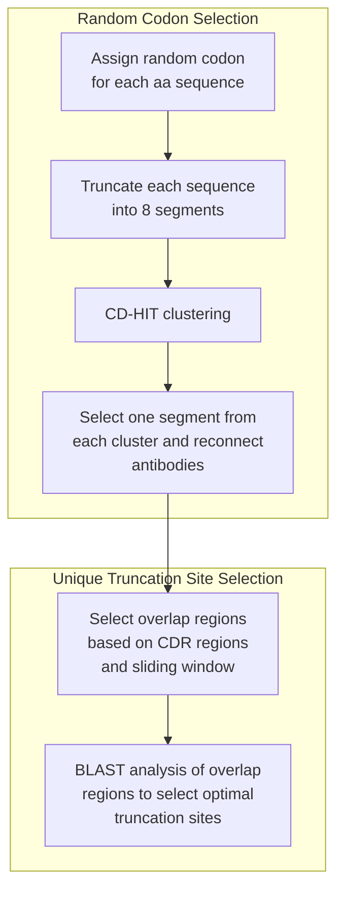

# Pipeline for Antibody Library Construction 

## Contents
- [Overview](#overview)
- [Setup and Usage](#setup-and-usage)
- [Pipeline Workflow](#pipeline-workflow)
- [Results and Analysis](#results-and-analysis)
- [References and Citations](#references-and-citations)

## Overview

This pipeline implements the oPool+ display technology for high-throughput synthesis and specificity characterization of natively paired influenza hemagglutinin antibodies. The system processes antibody sequence data through a six-step workflow to generate optimized DNA sequences for library construction.

A local/web user interface, courtesy of the Cursor Agent, is available for running this pipeline through an intuitive browser page. The UI provides step-by-step workflow navigation, file management, and real-time progress tracking.


## Setup and Usage

For complete setup instructions, input file requirements, and web UI usage, please see:

📖 **[Setup_details.md](Setup_details.md)** - Comprehensive setup guide with:
- Cross-platform environment setup
- Web UI interface documentation
- Input file format requirements
- Complete pipeline workflow
- Performance benchmarks and test results

### Quick Start
```bash
# Assume the environment has been set up properly
# Launch UI
conda activate oPool
cd oPool_design
python launch_ui.py
# Access at: http://localhost:5001
```
---

## Pipeline Workflow

We developed a comprehensive Python pipeline (`extract.py`) to automate the extraction, filtering, and completion of antibody sequences from Excel-formatted datasets. The pipeline implements the following key steps:

### Antibody Sequence Processing and Completion

1. **Initial Filtering**: Removal of incomplete entries and quality assessment
2. **Kabat Numbering**: Sequence alignment using standardized numbering schemes
3. **Germline Completion**: Identification and completion of truncated sequences using PyIR annotations
4. **Gene Family Filtering**: Removal of common V and D gene families (IGHV1-69, IGHV6-1, IGHV1-18, IGHD3-9)
5. **Clonotype Assignment**: Unique identifier assignment based on sequence similarity
6. **Sequence Validation**: Quality control and integrity verification

### Sequence Diversification Strategy

The iteration step employs a codon optimization strategy to maximize sequence diversity:

- **Codon Source**: Biologics Corp. codon usage table
- **Frequency Threshold**: Removal of codons with frequency < 15 per thousand
- **Randomization**: Assignment of random triplet codons to reduce nucleotide sequence similarity
- **PCR Optimization**: Minimization of non-native assembly during polymerase chain reaction

### Library Construction Methodology

The final library construction follows a systematic approach:

1. **Segment Generation**: Each antibody is truncated into 8 segments (99 bp each for segments 1-7)
2. **Similarity Clustering**: CD-HIT algorithm groups similar segments
3. **Representative Selection**: One sequence per cluster ensures maximum diversity
4. **Overlap Optimization**: 30-nt sliding window analysis around CDR regions
5. **BLAST Validation**: Similarity assessment using BLAST+ with optimized parameters
6. **Final Assembly**: 4-segment truncation based on optimal overlap sites

### 1. Data Filtering and Extraction

#### **1.1: Data Source**
The table was downloaded from the supplemental data of a paper by [Wang, et al; 2024](https://www.cell.com/immunity/fulltext/S1074-7613(24)00371-6). We deleted unpaired antibodies, incomplete antibodies, etc.

#### **1.2: PyIR Setup**
This script relies on the `pyir` package for annotation and germline retrieval. Follow the [PyIR installation instructions](https://github.com/crowelab/PyIR).

After installation, you should have the `pyir` database in the `crowelab_pyir/HA_screen/data/germlines/Ig/human` directory. 

**To find your PyIR database location:**
```bash
pyir -h | grep 'germlines'
```

**Expected output:**
```
Arguments related to file paths:
  --igdata IGDATA       Path to your IGDATA directory. Default is ~/miniconda3/envs/oPool/lib/python3.9/site-
                        packages/crowelab_pyir/HA_screen/data/germlines
```

**Note:** If you are using the UI, the path should be automatically detected.

#### **1.3: Run Extraction Script**
```bash
python HA_screen/script/extract.py -i HA_screen/data/TableS1.xlsx -v IGHV1-69 IGHV6-1 IGHV1-18 -d IGHD3-9 -g ${pyir_db}/Ig/human -o HA_screen/result/2024_0228_filtered.csv
```

**Parameters:**
- `-i`: Input table from the paper
- `-v`: V gene family filtering list (removes sequences from specified families, e.g., IGHV1-69)
- `-d`: D gene family filtering list (similar to `-v`, but for D gene families)
- `-g`: Human IG sequences database from PyIR for head and tail completion
- `-o`: Output results file

**Result:** After filtering, there were 303 sequences left.

#### **1.4: Manual Quality Control**
```bash
sed -i '/008_10_6C04/d;/K77-1A06/d;/36.a.02_Heavy/d' HA_screen/result/2024_0228_filtered.csv
```

Remove sequences that appear problematic after manual inspection.


## 2. Sequence Segments Iteration

**Command:**
```bash
python HA_screen/script/iteration.py -i HA_screen/result/2024_0228_filtered.csv -p 2000000 -n HA_screen/result/random_neg.csv -o HA_screen/result/TableS1_filtered.fa
```

**Parameters:**
- `-i`: Filtered table as input (result from Step 1)
- `-p`: Total number of random sequences to generate for unique sequence selection
- `-o`: Output FASTA file containing truncated sequences (8 segments per antibody)
- `-n`: Negative control sequence list

**Output Format:**
Each antibody sequence is truncated into 8 segments, where segments 1-7 contain exactly 99 bp (33 amino acids), and segment 8 contains the remaining sequence.

## 3. CD-HIT Clustering

**Command:**
```bash
nohup bash HA_screen/script/cd-hit.sh > cd-hit.log &
```

**Process:**
- **Input**: `TableS1_filtered.fa` from Step 2
- **Method**: Groups sequences based on similarity using CD-HIT algorithm
- **Output**: Results stored in `cdhit/` directory
- **Note**: This step is computationally intensive. For testing, reduce dataset size or modify similarity threshold in `HA_screen/script/cd-hit.sh`

## 4. CD-HIT Result Selection and Reassembly

**Command:**
```bash
python HA_screen/script/cdhit_result.py -i HA_screen/result/TableS1_filtered.fa -n HA_screen/result/random_neg.csv -gs 25 -ng 12 -nn 2
```

**Parameters:**
- `-i`: Input FASTA file from Step 2
- `-n`: Negative control list (same as Step 2)
- `-gs`: Number of final sequences per group (default: 25)
- `-ng`: Total number of groups to create (default: 12)
- `-nn`: Number of negative control sequences per group (default: 2)

## 5. Overlap Region Selection

**Command:**
```bash
python HA_screen/script/Overlap_check.py -i HA_screen/result/TableS1_filtered.fa -n HA_screen/result/random_neg.csv
```

**Process:**
The script generates potential overlap primers for each sequence using BLAST+ analysis with the following parameters:
- **Query**: `Primer/{group}`
- **Database**: `blastDB/{group}`
- **Output format**: `6 qacc sacc evalue pident qcovs`
- **E-value threshold**: 1e-1
- **Threads**: 8
- **Max HSPs**: 2
- **Word size**: Variable

Each sequence generates 30 potential primers around the CDR regions for subsequent selection.

## 6. Library Truncation and Primer Addition

**Command:**
```bash
python HA_screen/script/ChunkByOverlap.py
```

**Process:**
Final antibody library generation with replication primers added to 3' and 5' ends for DNA synthesis.

---

## Workflow Overview



---

## Technical Implementation Details

### Software Dependencies

**Core Libraries:**
- `pandas`: Data manipulation and analysis
- `numpy`: Numerical computations
- `abnumber`: Antibody numbering schemes
- `Biopython`: Biological sequence analysis
- `pyir`: Immunoglobulin sequence annotation

**Bioinformatics Tools:**
- `CD-HIT`: Sequence clustering and redundancy removal
- `BLAST+`: Sequence similarity analysis
- `PyIR`: Germline database integration

### Algorithm Parameters

**CD-HIT Clustering:**
- Similarity threshold: 0.85
- Word length: 5
- Memory optimization: Enabled

**BLAST Analysis:**
- E-value threshold: 1e-1
- Word size: Variable (3-7)
- Max HSPs: 2
- Thread count: 8

**Overlap Selection:**
- Window size: 30 nucleotides
- Sliding step: 5 nucleotides
- CDR region focus: H1, H3, L3

### Data Validation Protocols

1. **Sequence Completeness**: Verification of start and stop codons
2. **Reading Frame**: Validation of open reading frame integrity
3. **Germline Alignment**: Assessment of germline sequence compatibility
4. **Quality Metrics**: Calculation of sequence quality scores
5. **Redundancy Analysis**: Identification and removal of duplicate sequences

---

## References and Citations

### Primary Research Paper
**W. O. Ouyang et al., High-throughput synthesis and specificity characterization of natively paired influenza hemagglutinin antibodies using oPool+ display. Science Translational Medicine. 17, eadt4147 (2025).**

### Software and Tools
- **PyIR**: Immunoglobulin sequence annotation and germline retrieval
- **CD-HIT**: Sequence clustering and redundancy removal
- **BLAST+**: Sequence similarity analysis and overlap optimization
- **Abysis.org**: Online Kabat numbering platform

### Data Sources
- **Codon Usage Table**: Biologics Corp. codon optimization tools
- **Germline Database**: IMGT database for immunoglobulin sequences
- **Antibody Sequences**: Supplemental data from Wang et al. (2024)


